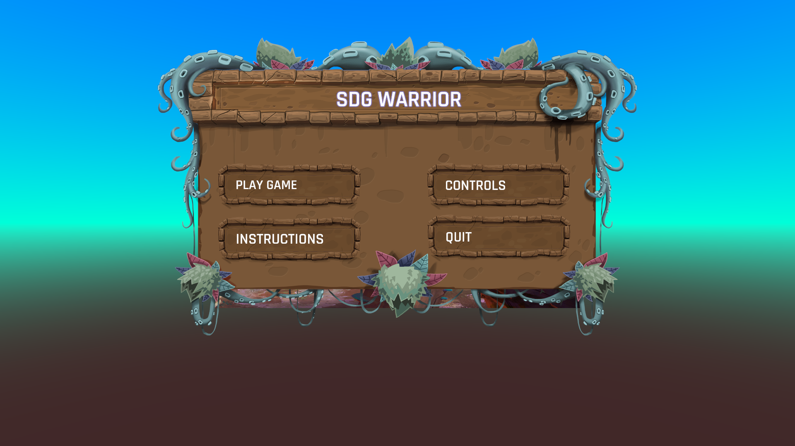

# sdgWarrior
## 1. Description of the game
### Idea and Uniqueness
Test players’ awareness of Sustainable Development Goals in the form of question pop-ups.
The game smoothly tries to implant the ideologies of SDGs by letting players immerse themselves in the fantasy 3D simulated game environment.
### Game Play
On clicking “PLAY GAME” on the start menu starts the game.
Players will have 5 lives and full recovery(of all lives) can be done using health crates.
Loss of single life happens when CHOMPER(enemy) attacks you.
Chomper can be taken down in a single hit(left mouse click).
Falling into an acid pool leads to immediate death(loss of all remaining lives).
### Reward system
Going near crystals triggers question pop-ups, answering correctly increases the score.
As of now, there are no negative points on wrong answers, since our aim is to make players explore the game.
Here are some screenshots of the game:
 
 
 
 

## 2. Frameworks and Technologies
### Development Platform: 
Unity
### Programming Language: 
C# (standard provided by Unity)
### Assets: 
3D Game Development Kit (beginner assets provided by Unity)

## 3. Platforms supported
As of now, the game runs only on Desktop.

## 4. Play SDG Warrior in your Desktop
### Executable File: 
### Pull from GitHub Repository: 
* Step1: Open an empty project in Unity
* Step2: Import 3D Unity Game Kit from:
https://assetstore.unity.com/packages/templates/tutorials/3d-game-kit-115747
* Step3: Clone the repository from:
https://github.com/RithikaSapparapu/sdgWarrior
* Step4: In the clone folder go to Documents => GitHub => sdgWarrior => SE-lab-project =>    Assets and copy all files.

* Step5: Now go to your previously created empty project folder in your explorer, the path will be something like My project (5) => Assets, then delete all other files and folders except 3DGamekit.

* Step6: Now paste previously copied files here. Go back to Unity platform(takes some time to refresh) and play the scene “sdgWarrior”.

## 5. Contribution
Individual contribution of teammates are clearly mentioned tasks wise in a spreadsheet of given link
https://docs.google.com/spreadsheets/d/18-r1sxEQsAcQaIKg3uvBRVtgB39OX89F1Yy922SMEjg/edit?usp=sharing
## 6. Links
* GitHub Repository Link:
https://github.com/RithikaSapparapu/sdgWarrior
* Demo Video Link:
* Executable File:

## Who is the audience for the game?
The game is designed to target youth and the younger generation by making them aware of the ideologies of the SDGs. Provided with the necessary understanding, skills and opportunities needed to reach their potential, young people can be a driving force for supporting development and contributing to the advancement of the Sustainable Development Goals!
